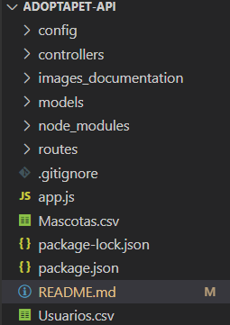
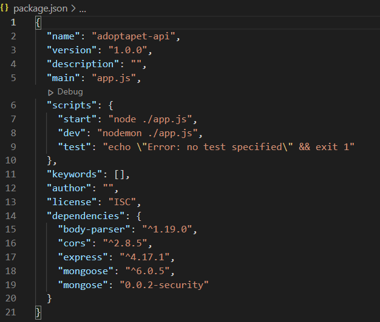
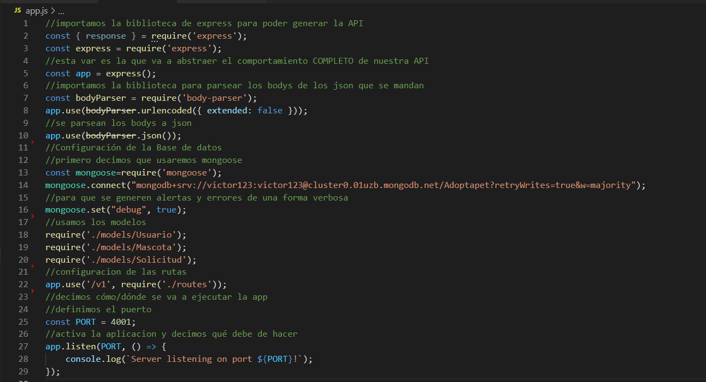
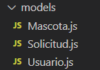
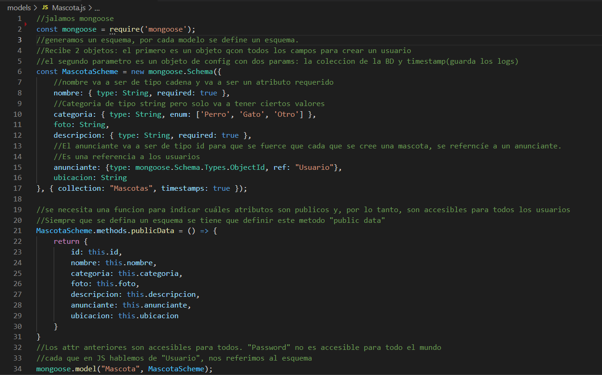

# Adoptapet API

## Main Goal
The goal of this project is provide a REST API about pet adoption.

## Technologies
This Backend project was made with Express, NodeJS, MongoDB and Mongoose

## General structure of the project
This project follow a very modular structure. 
Starting with the directories:

## Starting configuration

As you see, we have different directories and files which do different tasks: 
The base of the configuration of this project is the file `package.json`. This file contain few commands for get more easier our process of running and deploying of the project

As you see, we are using 3 different commands, but, the most used in this project is the thirth one: `dev`, which allows compile, run and deploy the app after start the server and do any change on the code. Automatize the task of stop and run the server after any change.

Also, we are using different dependences: `body-parser`, `express` and `mongoose`. 

## Deploying the project
Beforte starting with the documentation of specific files, is very important how to star to run our project.
The `app.js` file contains the next sentences

With the lines 2-13 we are requiring the respectives dependences for the correct work of the project, however, the base for running the app is in the line 5, which is requiring the "express" module. In the line 25 and 27 we are declarating the Listening port and launching the project, respectivetly. 
So, for being able to access to the API, we must type `localhost:4001/v1` in the URL section of our prefer web browser.

## The base of our database and API

The base of our "entities" of the API are located in the directory `models`. This carpet contains 1 file for each entity of the API. In this case, we are using 3: "Mascota", "Solicitud" and "Usuario"

If we see each file of this directory, we can see that all of them, follows a very similar arquitechture. For example, lets talk about the `Mascota.js` file:

In the line 2, the only thing that we are doing is requiring the dependence "mongoose", this is because we need to define a "skeleton" of the entity, we are taking as base the Schema of the MongoDB model (line 6 to 17)

With the lines 21-31, we are allowing to the end user to enter to these attributes whenever he want. This is by the use of the `publicData` function.

The last sentence of this file is indicating that when we use the word "Mascota", we are doing refference to the schema of the database.

The previous explanation is very similar to the other models.

## Starting with the CRUD
